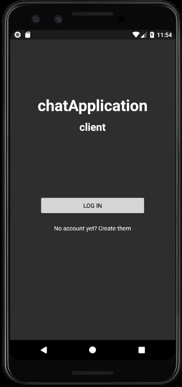
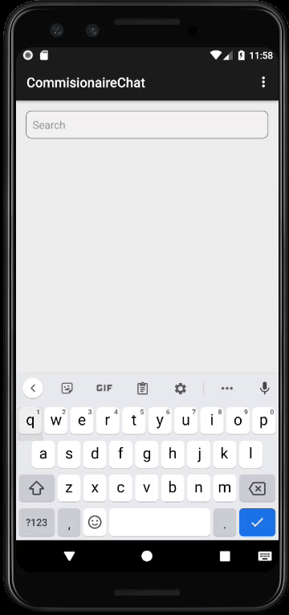
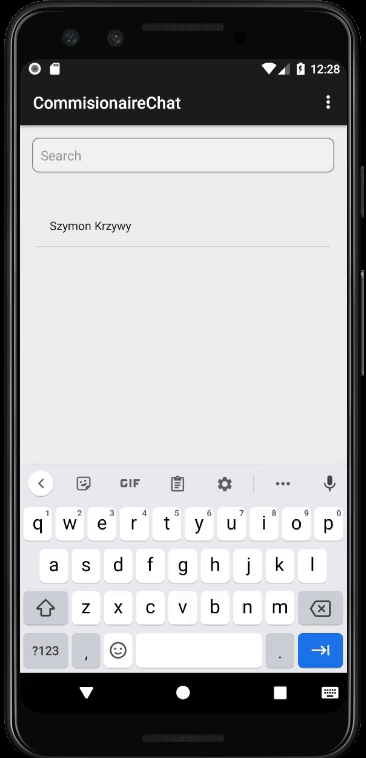
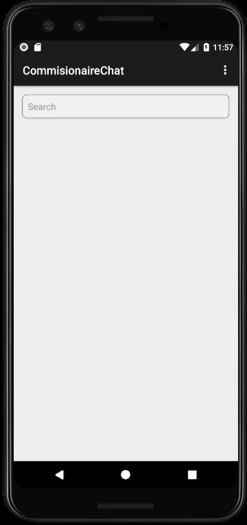

## chatApp-client
written in 
######Java

<h3>Signup&nbsp;&nbsp;&nbsp;&nbsp;&nbsp;&nbsp;&nbsp;&nbsp;&nbsp;
&nbsp;&nbsp;&nbsp;&nbsp;&nbsp;&nbsp;&nbsp;&nbsp;&nbsp;&nbsp;&nbsp;
&nbsp;&nbsp;&nbsp;&nbsp;&nbsp;&nbsp;&nbsp;&nbsp;&nbsp;&nbsp;&nbsp;
&nbsp;&nbsp;&nbsp;&nbsp;&nbsp;&nbsp;&nbsp;&nbsp;Login</h3>

<h3>Account created in user table</h3>

<h3>Live search</h3>
You can find and add new user to your account from search engine 

#And main functionality
###### Write with users and send photos to each other!
At this moment messages are save in mobile database - SQLite  (not in server db - PostgresSQL)

 you can also
<h3>Change password or logout</h3>

